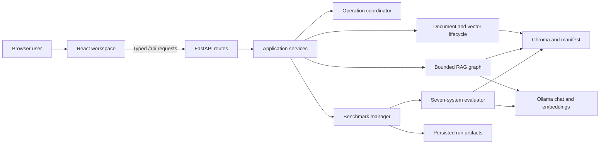

# Local Document RAG

A local-first RAG workbench that turns PDF and TXT documents into inspectable,
cited answers and provides a reproducible seven-system benchmark for evaluating
retrieval and answer workflows.

> **Portfolio release:** The React/FastAPI workspace, offline quality gate,
> responsive browser coverage, and live Ollama workflow have been completed and
> recorded. Local verification passed on August 1, 2026. A successful GitHub
> Actions run for the final commit is not claimed.


## Project summary

Local Document RAG is a single-user application for working with private
documents through local models. It combines semantic and lexical retrieval,
bounded multi-step orchestration, evidence grading, citation validation, and
explicit abstention in one React workspace served by FastAPI.

The application is also an evaluation workbench. Its embedded Full RAG
Benchmark compares three retrieval baselines, three fixed single-call RAG
baselines, and the bounded workflow on the same 20 MultiHopRAG development
cases. Each result remains inspectable by case, evidence, failure class, and
public execution trace.

## Engineering ownership

I designed and implemented the current product architecture and release: the
React/FastAPI workspace, document lifecycle, hybrid retrieval, bounded RAG
workflow, citation safeguards, benchmark execution and persistence, responsive
browser coverage, and release validation. The repository history and the
[release closure record](REFACTORING_CLOSURE_PLAN.md) preserve that work in
reviewable increments.

The project began from the
[AI Workshop 2025 GenAI Session](https://github.com/Antonio-Tresol/ai_workshop_2025_gen_ai_session).
The workshop origin is acknowledged here; the current application and its
evaluation workflow are the subsequent portfolio implementation.

## What the application does

- Uploads, indexes, lists, and deletes PDF or TXT documents while preserving
  stable source and chunk provenance.
- Combines semantic retrieval and BM25 with Reciprocal Rank Fusion and
  deterministic diversity selection.
- Routes direct questions, decomposes multi-hop questions into at most four
  subqueries, retrieves independent subqueries concurrently, and permits at
  most one targeted retry.
- Grades evidence, removes irrelevant context, validates citations, and
  abstains when indexed documents do not support an answer.
- Exposes filenames, pages, excerpts, retrieval scores, query decisions, and
  public trace events without exporting private reasoning.
- Keeps the workspace usable when Ollama is offline and explains which actions
  require models or a healthy index.
- Runs, cancels, persists, reopens, inspects, and downloads a reproducible
  seven-system benchmark without replacing the document workspace.

## Verified engineering evidence

The repository gate completed successfully on August 1, 2026. The recorded
release evidence is:

| Check | Recorded result |
| --- | ---: |
| Backend tests | 261 passed |
| Backend branch coverage | 87.58% |
| Frontend tests | 79 passed |
| Playwright scenarios | 5 passed across desktop, tablet, and mobile |
| Frontend dependency audit | Zero known vulnerabilities on August 1, 2026 |

Locked Python and frontend dependency installation, TypeScript checks, the
production build, Ruff lint and formatting, Pyright, Lanorme, offline runtime
diagnostics, and the non-live-Ollama backend suite also passed. These are local
release results, not a claim about a later dependency state or an unrecorded CI
run. See the exact gate in [`scripts/verify.sh`](scripts/verify.sh) and the
[release-readiness report](REFACTORING_CLOSURE_PLAN.md#task-17-release-readiness-report).

Run the same repository gate from the project root:

```bash
./scripts/verify.sh
```

## Live benchmark execution evidence

A real production build was exercised with Ollama and no simulated model
responses on August 1 and 2, 2026.

- Tested commit: `bcd11d827c1fb6868e7242d39cec9434abce9727`
- Ollama: `0.31.2`
- Chat model: `qwen3.5:9b`, Q4_K_M, 9.7B parameters
- Embedding model: `nomic-embed-text:latest`, F16, 137M parameters
- Hardware: NVIDIA GeForce RTX 4060 Laptop GPU with 8 GB VRAM
- Dataset: `yixuantt/MultiHopRAG`, development split
- Prepared corpus: 609 documents and 12,743 chunks
- Completed run: 140 unique case-system results, 20 cases for each of seven
  systems
- Wall-clock duration: 2,379.455 seconds, or 39 minutes 39.455 seconds

The run persisted all four expected artifacts, reopened after a clean
application restart, downloaded byte-for-byte through the React interface, and
exposed clean, expectation-failure, and runtime-failure cases. A separate live
cancellation check confirmed that the active Ollama call could finish while no
later case or model call started. The full environment, model digests, artifact
hashes, timings, and deviations are in the
[live Ollama validation record](docs/live-ollama-validation.md).

## Benchmark findings

Completed execution is evidence that the workflow runs and persists correctly.
It is not evidence that the evaluated systems achieved strong benchmark
quality. The recorded run produced 42 clean results, 97 expectation failures,
and one runtime failure.

| System | Clean | Expectation failures | Runtime failures | Trace duration |
| --- | ---: | ---: | ---: | ---: |
| Dense | 12 | 8 | 0 | 3.045 s |
| BM25 | 14 | 6 | 0 | 5.235 s |
| Hybrid | 12 | 8 | 0 | 6.237 s |
| Dense RAG | 0 | 20 | 0 | 351.040 s |
| BM25 RAG | 3 | 17 | 0 | 392.957 s |
| Hybrid RAG | 1 | 19 | 0 | 511.186 s |
| Full RAG | 0 | 19 | 1 | 977.920 s |

This small, fixed development set supports workflow comparison and regression
inspection, not broad model-quality conclusions. Model-backed results were
especially weak in this run. The local qwen model also returned incomplete
structured evidence grading for an exact retrieved fixture, which correctly
caused a conservative abstention.

One methodological limitation remains in the recorded environment: artifacts
declare a 30 second request timeout, but observed model-backed case latency was
not capped at 30 seconds. Full RAG p95 latency was 228.057 seconds and the sole
runtime-error case took 75.492 seconds. Results should be interpreted with that
deviation in mind.

## Quickstart

### Requirements

- Python 3.12
- [uv](https://docs.astral.sh/uv/)
- Node.js 22
- [Ollama](https://ollama.com/)
- Enough local storage and memory for `qwen3.5:9b` and `nomic-embed-text`

Clone the repository, install locked dependencies, build the frontend, and
prepare the models:

```bash
git clone https://github.com/GabrielMBulgarelli/RAG.git
cd RAG

uv python install 3.12
uv sync
npm --prefix frontend ci
npm --prefix frontend run build

ollama pull qwen3.5:9b
ollama pull nomic-embed-text
ollama serve
```

In another terminal, start the production application:

```bash
uv run python -m modules.run
```

Open [http://127.0.0.1:7860](http://127.0.0.1:7860). A successful startup
serves the React workspace at `/`. If Ollama is offline, the workspace still
loads and reports limited readiness instead of failing at startup.

## Primary browser workflow

1. Open **System status** to confirm Ollama, model, uploaded-index, and benchmark
   readiness.
2. Load the configured chat model from the sidebar.
3. Upload one or more PDF or TXT files and confirm they appear under indexed
   documents.
4. Ask a question in the conversation surface.
5. Open the inspector to review citations, retrieved chunks, query decisions,
   and the public execution trace.
6. Clear or export the conversation, or manage the indexed documents from the
   same route.

Benchmark preparation and execution are intentionally separate from uploaded
documents. Responsive workspace states and result overlays are shown in the
[visual verification gallery](docs/visual-verification.md).

## Architecture



Responsibility boundaries stay explicit:

- React owns interaction state, the continuous workspace, overlays, and typed
  API consumption.
- FastAPI owns HTTP contracts, lifecycle, validation, and public error mapping.
- Application services coordinate documents, conversations, operations, and
  benchmark presentation without depending on React.
- The RAG graph owns bounded routing, retrieval, evidence grading, answer
  generation, and termination.
- The benchmark manager owns run state, persistence, reopening, cancellation,
  case inspection, and downloads.
- Ollama owns local chat and embedding inference. Chroma and the manifests own
  indexed state.

## Technology stack

| Responsibility | Technology |
| --- | --- |
| Browser application | React 19, TypeScript, Vite |
| HTTP application | FastAPI, Uvicorn, Pydantic |
| RAG orchestration | LangChain, LangGraph |
| Retrieval | Chroma, `nomic-embed-text`, BM25, Reciprocal Rank Fusion |
| Local generation | Ollama, `qwen3.5:9b` |
| Backend quality | pytest, coverage.py, Ruff, Pyright, Lanorme |
| Frontend quality | Vitest, Testing Library, Playwright |
| Dependency management | uv and npm lockfiles |

## Benchmark methodology

The benchmark uses the canonical 20-case development selection from
[MultiHopRAG](https://huggingface.co/datasets/yixuantt/MultiHopRAG) and evaluates
seven systems:

| Group | Systems |
| --- | --- |
| Retrieval only | `dense`, `bm25`, `hybrid` |
| Fixed single-call RAG | `dense-rag`, `bm25-rag`, `hybrid-rag` |
| Bounded workflow | `full-rag` |

Prepare the isolated benchmark corpus and index before the first run:

```bash
uv run python scripts/prepare_multihop_eval.py --index
```

Preparation does not alter documents uploaded through the application. The Run
benchmark action remains unavailable until diagnostics confirm the cases,
source mapping, non-empty manifest, populated Chroma index, and loaded models.

The same evaluation is available from the command line:

```bash
uv run python -m modules.evaluation \
  --systems all \
  --split development \
  --dataset multihop \
  --model qwen3.5:9b
```

Each run records its commit, dataset identifier and content hash, exact case
IDs, models, temperature, prompt identity, graph and chunking settings,
retrieval and context limits, retry and subquery limits, request timeout, and
timestamps. Run data is stored under `evals/results/full_rag/<run-id>/`:

```text
run.json       # Lifecycle, reproducibility metadata, and progress
summary.json   # Aggregates, sections, and failure counts
cases.jsonl    # One inspectable record per case-system result
events.jsonl   # Durable progress and terminal events
```

Metrics distinguish measured values, values that do not apply to a system, and
values with no eligible cases. Runtime failures remain failures and cannot
improve answer or abstention metrics. Cancelled and failed runs stay inspectable
but do not replace the latest completed result.

## Configuration

Settings use the `RAG_` prefix and may be placed in `.env`:

```dotenv
RAG_OLLAMA_BASE_URL=http://localhost:11434
RAG_LLM_MODEL=qwen3.5:9b
RAG_EMBEDDING_MODEL=nomic-embed-text
RAG_SERVER_HOST=127.0.0.1
RAG_SERVER_PORT=7860
```

Chunking, retrieval budgets, context limits, retry and subquery bounds, paths,
timeouts, and server settings are validated in
[`modules/config.py`](modules/config.py) before runtime clients are constructed.

## API summary

FastAPI exposes the typed contract under `/api`:

- Runtime and health: `GET /runtime`, `POST /runtime/models`, and
  `GET /diagnostics`
- Documents: `GET /documents`, `POST /documents`, and
  `DELETE /documents/{document_id}`
- Conversations: `POST /query`, `DELETE /conversations/{session_id}`, and
  `POST /conversations/export`
- Benchmarks: start, latest, snapshot, event stream, cancellation, case list,
  case detail, and download routes under `/benchmarks`

The complete user-visible route contract is maintained in
[`ACCEPTANCE_CRITERIA.md`](ACCEPTANCE_CRITERIA.md#8-api-contract).

## Repository structure

```text
frontend/                   # React workspace, benchmark UI, and browser tests
modules/
├── api/                    # FastAPI routes, dependencies, and error mapping
├── application/            # Workspace, operation, and benchmark services
├── app.py                  # FastAPI and built-frontend launcher
├── bootstrap.py            # Production dependency composition
├── citations.py            # Answer and citation validation
├── evaluation.py           # Seven-system benchmark CLI
├── rag_graph.py            # Bounded retrieval and answer workflow
├── retrieval.py            # Semantic, BM25, fusion, and selection
├── vector_db.py            # Ingestion, manifest, and Chroma lifecycle
└── run.py                  # Package-safe local entry point

scripts/                    # Benchmark preparation and release verification
tests/                      # Backend unit and integration coverage
docs/                       # Visual, live-runtime, and design evidence
```

## Design decisions and scope

- The product uses one browser route. Results, diagnostics, confirmations, and
  case inspection open as overlays so document work stays in context.
- Uploaded documents and benchmark data use separate storage and preparation
  paths. Benchmark setup cannot mutate a user's corpus.
- Orchestration is bounded to four subqueries and one retry. This keeps failure
  and termination behaviour observable.
- Cancellation is cooperative. An active Ollama request may finish, but no new
  case or model call begins after cancellation is recorded.
- Missing uploaded-document state means an empty corpus. Corrupt, incomplete,
  or incompatible index state produces an actionable diagnostic instead of a
  silent reset.
- This is a local, single-user workbench. Authentication, multi-tenant storage,
  hosted deployment, and claims of production-scale benchmark validity are
  outside the current scope.

## Documentation

- [`ACCEPTANCE_CRITERIA.md`](ACCEPTANCE_CRITERIA.md) defines the user-visible
  completion contract.
- [`docs/visual-verification.md`](docs/visual-verification.md) contains current
  desktop, tablet, mobile, benchmark, and diagnostic captures.
- [`docs/live-ollama-validation.md`](docs/live-ollama-validation.md) records the
  live environment, complete run, cancellation test, and limitations.
- [`REFACTORING_CLOSURE_PLAN.md`](REFACTORING_CLOSURE_PLAN.md) records the
  implementation sequence and final release gate.
- [`docs/superpowers/specs/2026-08-01-readme-rewrite-design.md`](docs/superpowers/specs/2026-08-01-readme-rewrite-design.md)
  defines the editorial design for this README.

## Acknowledgments

The initial workshop material came from Antonio Tresol's
[AI Workshop 2025 GenAI Session](https://github.com/Antonio-Tresol/ai_workshop_2025_gen_ai_session).
The benchmark uses the
[MultiHopRAG dataset](https://huggingface.co/datasets/yixuantt/MultiHopRAG).
