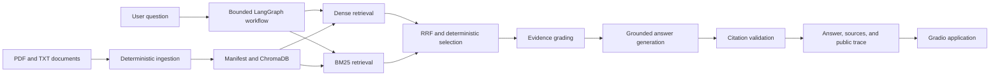

# Local Agentic RAG Workbench

A fully local Retrieval-Augmented Generation workbench for document question answering, retrieval experiments, and transparent agentic workflows. It combines PDF/TXT ingestion, dense and BM25 retrieval, Reciprocal Rank Fusion (RRF), bounded LangGraph orchestration, cited answers, document lifecycle controls, and reproducible evaluation in one Gradio application.

The project is designed as an applied AI engineering case study: every response can be inspected from routing and query decomposition through retrieval, evidence grading, citations, retries, and termination.

## What this project demonstrates

- **Local AI integration:** Ollama serves both `qwen3.5:9b` and `nomic-embed-text`, keeping documents and inference on the local machine.
- **Deterministic ingestion:** stable document and chunk IDs, PDF page metadata, atomic manifests, incremental updates, and ChromaDB reconciliation.
- **Hybrid retrieval:** semantic search and BM25 are combined with RRF, document diversity, subquery coverage, and lexical redundancy control.
- **Bounded agentic control:** the LangGraph workflow routes requests, decomposes multihop questions, grades evidence, performs at most one retry, and always reaches a defined outcome.
- **Grounded answers:** source labels map back to retrieved chunks, filenames, pages, and excerpts; unknown citations are rejected deterministically.
- **Evaluation discipline:** dense, BM25, hybrid, and agentic systems are measured with retrieval, workflow, citation, and answer metrics.
- **Inspectable UX:** Gradio exposes document management, chat traces, retrieval scores, evaluation comparisons, and local diagnostics.
- **Engineering quality:** strict Pydantic settings, typed contracts, Ruff, Pyright, pytest, coverage, and a reproducible `uv.lock` environment.

## Measured benchmark

The repository includes a held-out multihop benchmark so the application can be assessed with recorded evidence rather than demo impressions. The following results come from the checked-in `test` run at `evals/results/multihop/20260712T093825Z-test/summary.json`.

### Retrieval comparison

| System | Recall@5 | Document Recall@5 | MRR@5 | nDCG@5 |
| --- | ---: | ---: | ---: | ---: |
| Dense | 0.344 | 0.438 | 0.354 | 0.279 |
| BM25 | 0.375 | 0.635 | 0.458 | 0.375 |
| Hybrid | **0.469** | 0.594 | **0.588** | **0.453** |
| Agentic | 0.375 | 0.594 | 0.292 | 0.298 |

These measurements provide a concrete reference for discussing retrieval trade-offs, grounding behavior, and iterative AI system design.

## Architecture



### Query lifecycle

1. The workflow turns a context-dependent follow-up into a standalone query when needed.
2. Routing selects catalog, clarification, out-of-scope, simple-search, or complex-search behavior.
3. Complex questions can be decomposed into at most four subqueries.
4. Dense and BM25 candidates are fused and selected with provenance and intermediate scores preserved.
5. Evidence is graded as `sufficient`, `limited`, or `insufficient`.
6. The generator returns a grounded answer or a bounded non-answer outcome.
7. Citation validation maps every accepted label to a retrieved source.
8. A public trace records decisions, counts, durations, evidence state, retry count, and termination without exposing private chain-of-thought.

## Application experience

The Gradio interface organizes the complete local workflow into two task-focused views:

- **Workspace:** ask questions, inspect cited evidence, export conversations, and manage the PDF/TXT corpus. Index repair, indexing errors, and local system status remain available as collapsed supporting details.
- **Evaluation:** automatically review the newest compatible MultiHopRAG result or run the standard development benchmark across dense, BM25, hybrid, and agentic systems. Split and system selection remain available under Advanced options.

The interface can open without loading Ollama models. When generation or embedding is needed, the compact application status explains the missing requirement and exposes **Load AI models**.

## Technology stack

| Area | Technology |
| --- | --- |
| Language and environment | Python 3.12, uv |
| Local generation | Ollama, Qwen 3.5 9B |
| Embeddings | `nomic-embed-text` |
| Agent workflow | LangGraph, LangChain |
| Retrieval | ChromaDB, BM25, Reciprocal Rank Fusion |
| Data contracts | Pydantic |
| Interface | Gradio |
| Quality gates | pytest, pytest-cov, Ruff, Pyright |

## Prerequisites

- [uv](https://docs.astral.sh/uv/)
- [Ollama](https://ollama.com/) installed and running
- Approximately 7 GB of local model storage, plus space for indexed documents
- Required Ollama models:
  - `qwen3.5:9b`
  - `nomic-embed-text`

## Installation

1. Clone the repository:

   ```bash
   git clone https://github.com/GabrielMBulgarelli/RAG
   cd RAG
   ```

2. Install the managed Python interpreter and synchronize the locked environment:

   ```bash
   uv python install 3.12
   uv sync --frozen
   ```

3. Pull the local models:

   ```bash
   ollama pull qwen3.5:9b
   ollama pull nomic-embed-text
   ```

4. Confirm that Ollama is available:

   ```bash
   curl http://127.0.0.1:11434/api/tags
   ollama list
   ```

## Run the application

```bash
uv run python -m modules.run
```

Open [http://127.0.0.1:7860](http://127.0.0.1:7860). The startup preflight checks the Ollama service, required models, local paths, and index state before the interface accepts questions.

Documents can be uploaded from the **Documents** tab or placed directly in `sources/` and indexed from the application.

## Run an evaluation

Run the existing multihop development split across every system:

```bash
uv run python -m modules.evaluation \
  --systems all \
  --split development \
  --dataset multihop
```

Evaluation artifacts are written under `evals/results/` and include the experiment configuration, per-case outputs, aggregate metrics, and failure taxonomy used by the comparison UI.

## Configuration

Copy the example environment file and customize any `RAG_`-prefixed values:

```bash
cp .env.example .env
```

Key settings include:

| Setting | Default | Purpose |
| --- | --- | --- |
| `RAG_OLLAMA_BASE_URL` | `http://localhost:11434` | Ollama API endpoint |
| `RAG_LLM_MODEL` | `qwen3.5:9b` | Generation model |
| `RAG_EMBEDDING_MODEL` | `nomic-embed-text` | Embedding model |
| `RAG_SEMANTIC_CANDIDATES` | `10` | Dense candidates per query |
| `RAG_SPARSE_CANDIDATES` | `10` | BM25 candidates per query |
| `RAG_MAX_CANDIDATES` | `20` | Maximum fused candidate pool |
| `RAG_MAX_CONTEXT_CHUNKS` | `6` | Final context budget |
| `RAG_MAX_SUBQUERIES` | `4` | Bounded decomposition budget |
| `RAG_MAX_RETRIES` | `1` | Bounded retrieval retry budget |
| `RAG_GRADIO_PORT` | `7860` | Local application port |

Settings are validated before Ollama or ChromaDB clients are constructed. Unknown values and invalid combinations are rejected with actionable messages.

## Project structure

```text
RAG/
├── modules/
│   ├── app.py              # Gradio UI and application actions
│   ├── citations.py        # Deterministic citation labeling and validation
│   ├── config.py           # Strict local settings
│   ├── evaluation.py       # Benchmark runner and metrics
│   ├── models.py           # Shared typed contracts
│   ├── rag_graph.py        # Bounded agentic workflow
│   ├── retrieval.py        # Dense, BM25, RRF, and candidate selection
│   ├── run.py              # Startup preflight and application entry point
│   ├── tools.py            # Ollama-backed workflow tools
│   └── vector_db.py        # Ingestion, manifest, and ChromaDB lifecycle
├── tests/                  # Unit and integration tests
├── evals/                  # Datasets and recorded evaluation results
├── scripts/                # Verification and benchmark helpers
├── sources/                # Local source documents
├── data/                   # Local manifest, ChromaDB, and traces
├── pyproject.toml          # Dependencies and quality configuration
└── uv.lock                 # Reproducible dependency lock
```

`references/AtlasRAG/` and `references/aianytime/` are separate local reference checkouts and remain independent from the application code.

## Verification

The standard repository gate synchronizes the locked environment, checks formatting and linting, runs static type analysis, and executes the offline test suite:

```bash
./scripts/verify.sh
```

Focused development checks can be run independently:

```bash
uv run pytest --no-cov tests/test_retrieval_observability.py
uv run ruff check .
uv run pyright
```

Tests marked `ollama` are reserved for explicit local integration runs; ordinary verification remains deterministic and does not require model inference.

## Troubleshooting

### Ollama is unavailable

Start the local service:

```bash
ollama serve
```

If the command reports `address already in use` for `127.0.0.1:11434`, an Ollama server is already listening. Confirm it with:

```bash
curl http://127.0.0.1:11434/api/tags
```

### A required model is not listed

```bash
ollama pull qwen3.5:9b
ollama pull nomic-embed-text
ollama list
```

### The Python environment needs synchronization

```bash
uv sync --frozen
```

### The local index needs refreshing

Use **Reconcile manifest/index** to inspect stored state, or **Rebuild complete index** from the **Documents** tab to regenerate it from the local source files.

## Project scope

This repository focuses on local, inspectable RAG engineering: retrieval behavior, bounded orchestration, grounding, document lifecycle, and repeatable measurement. Inference and document storage remain on the developer workstation through Ollama and ChromaDB.

## Origin and attribution

This project began from the [AI Workshop 2025 GenAI Session](https://github.com/Antonio-Tresol/ai_workshop_2025_gen_ai_session). Project-specific work expands that foundation into a typed, bounded agentic RAG workbench with deterministic ingestion, hybrid retrieval, citation validation, evaluation artifacts, diagnostics, tests, and full document lifecycle controls.

Please refer to the original project's license terms when using the adapted code.

## Acknowledgments

- [LangChain](https://python.langchain.com/) and [LangGraph](https://langchain-ai.github.io/langgraph/) for orchestration primitives
- [Ollama](https://ollama.com/) for local model serving
- [ChromaDB](https://www.trychroma.com/) for vector storage
- [Gradio](https://gradio.app/) for the application interface
- Antonio-Tresol for the original workshop foundation
