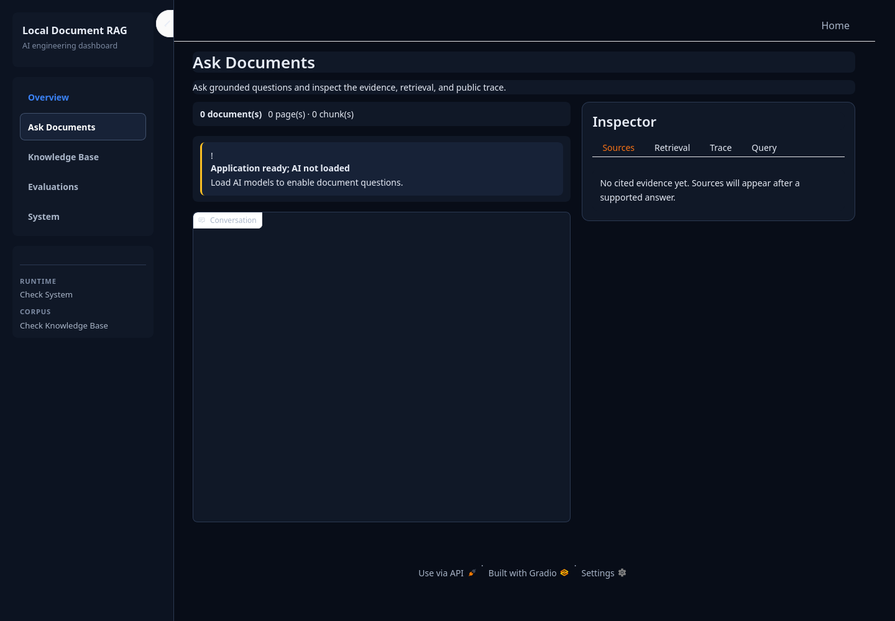

# Local Document RAG

A local-first Retrieval-Augmented Generation workbench for asking questions
about PDF and TXT documents with inspectable evidence. The application combines
hybrid retrieval, bounded multi-step reasoning, citation validation, and local
model inference.

## Interface



The React interface is one continuous workspace:

- A compact sidebar owns upload, indexed-document management, runtime state,
  and secondary actions.
- The conversation remains the dominant surface, with its composer, citations,
  clear action, and export action always available.
- A collapsible inspector shows sources and detailed retrieval, query, and
  trace information.
- Benchmark results, case details, diagnostics, and confirmations use overlays
  rather than route-level pages.

The FastAPI process owns the workspace services, exposes the typed `/api`
contract, and serves the built React application from `/`.

## Highlights

- **Local document workflow:** upload, index, inspect, update, and delete PDF
  or TXT sources.
- **Hybrid retrieval:** combines semantic search and BM25 with Reciprocal Rank
  Fusion, deterministic diversity selection, and stable chunk provenance.
- **Bounded RAG orchestration:** routes simple questions directly, decomposes
  multi-hop questions, searches independent subqueries concurrently, and
  permits at most one targeted retry.
- **Evidence-aware answers:** grades support, filters irrelevant context,
  validates citations, and abstains when evidence is insufficient.
- **Inspectable results:** exposes cited excerpts, source pages, retrieval
  scores, public traces, and privacy-safe conversation exports.
- **Graceful local startup:** the workspace opens without Ollama and reports
  limited readiness until the configured models are available.

## Requirements

- Python 3.12
- [uv](https://docs.astral.sh/uv/)
- Node.js 22
- [Ollama](https://ollama.com/)
- `qwen3.5:9b`
- `nomic-embed-text`

## Quickstart

```bash
git clone https://github.com/GabrielMBulgarelli/RAG.git
cd RAG

uv python install 3.12
uv sync

cd frontend
npm ci
npm run build
cd ..

ollama pull qwen3.5:9b
ollama pull nomic-embed-text
ollama serve
```

Start the application:

```bash
uv run python -m modules.run
```

Open [http://127.0.0.1:7860](http://127.0.0.1:7860). The workspace remains
available in limited-readiness mode when Ollama is offline.

The benchmark overlay runs the embedded MultiHopRAG development suite across
seven systems: three retrieval-only baselines, three fixed single-call RAG
baselines, and the bounded full RAG workflow. Results use schema v3, retain
explicit not-applicable metric states, persist across restarts, and expose
case details without replacing the workspace. The same evaluator is available
from the CLI:

```bash
uv run python -m modules.evaluation \
  --systems all \
  --split development \
  --dataset multihop \
  --model qwen3.5:9b
```

## Quality checks

```bash
./scripts/verify.sh
```

The gate installs locked backend and frontend dependencies, runs frontend
tests/typechecking/build/audit, checks Python formatting and types, runs the
offline backend suite, and verifies offline diagnostics.

## Configuration

Settings use the `RAG_` prefix and can be placed in `.env`:

```dotenv
RAG_OLLAMA_BASE_URL=http://localhost:11434
RAG_LLM_MODEL=qwen3.5:9b
RAG_EMBEDDING_MODEL=nomic-embed-text
RAG_SERVER_HOST=127.0.0.1
RAG_SERVER_PORT=7860
```

Retrieval budgets, chunking, retry limits, paths, and server settings are
validated in [`modules/config.py`](modules/config.py) before runtime clients
are constructed.

## Project structure

```text
frontend/                   # React single-workspace interface
modules/
├── api/                    # FastAPI routes, lifecycle, and error mapping
├── application/            # Presentation-neutral workspace services
├── app.py                  # FastAPI/React production launcher
├── bootstrap.py            # Production dependency composition
├── citations.py            # Answer and citation validation
├── evaluation.py           # Seven-system schema-v3 benchmark CLI
├── rag_graph.py            # Bounded retrieval and answer workflow
├── retrieval.py            # Semantic, BM25, fusion, and selection
├── vector_db.py            # Ingestion, manifest, and Chroma lifecycle
└── run.py                  # Package-safe local entry point

scripts/
├── prepare_multihop_eval.py
└── verify.sh

tests/                      # Offline unit and integration coverage
```

## What this project demonstrates

- Practical RAG design beyond a basic vector-search demo.
- Deterministic safeguards around probabilistic model behavior.
- Retrieval and answer evaluation with explicit metric applicability.
- Local model integration with graceful failure handling.
- Typed Python, automated quality gates, and an accessible task-oriented UI.

## Acknowledgments

The project began from the
[AI Workshop 2025 GenAI Session](https://github.com/Antonio-Tresol/ai_workshop_2025_gen_ai_session)
and has since expanded with document lifecycle management, hybrid retrieval,
bounded orchestration, citation validation, evaluation, and a redesigned local
interface.
