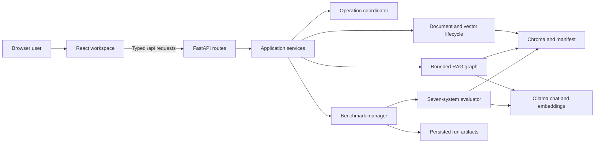

# Local Document RAG

## Project description

Local Document RAG is a local-first React and FastAPI workbench for turning PDF
and TXT documents into inspectable, cited answers. It combines hybrid retrieval,
bounded multi-step orchestration, evidence grading, citation validation, and
explicit abstention while keeping documents and model inference on the local
machine.

The same workspace includes a reproducible seven-system benchmark for comparing
retrieval and answer workflows on a fixed MultiHopRAG development selection.
See the [product definition](docs/product.md) for its users, workflows,
capabilities, readiness states, and deliberate boundaries.

## Screenshot


## Features

- Upload, index, list, and delete PDF or TXT documents with stable source and
  chunk provenance.
- Combine semantic retrieval and BM25 through Reciprocal Rank Fusion and
  deterministic diversity selection.
- Route direct questions or decompose multi-hop questions into at most four
  subqueries, with no more than one targeted retry.
- Grade evidence, remove irrelevant context, validate citations, and abstain
  when the indexed documents do not support an answer.
- Inspect filenames, pages, excerpts, retrieval scores, query decisions, and
  public execution traces without exposing private reasoning.
- Continue using the browser workspace when Ollama is offline, with explicit
  readiness guidance for model-dependent actions.
- Run, cancel, persist, reopen, inspect, and download seven-system benchmark
  results independently of uploaded documents.

## Quick start

### Requirements

- Python 3.12
- [uv](https://docs.astral.sh/uv/)
- Node.js 22
- [Ollama](https://ollama.com/)
- Enough local storage and memory for `qwen3.5:9b` and `nomic-embed-text`

Clone the repository, install locked dependencies, build the frontend, and
prepare the local models:

```bash
git clone https://github.com/GabrielMBulgarelli/RAG.git
cd RAG

uv python install 3.12
uv sync
npm --prefix frontend ci
npm --prefix frontend run build

ollama pull qwen3.5:9b
ollama pull nomic-embed-text
ollama serve
```

In another terminal, start the application:

```bash
uv run python -m modules.run
```

Open [http://127.0.0.1:7860](http://127.0.0.1:7860). The React workspace is
served at `/`; if Ollama is unavailable, the workspace still loads and reports
limited readiness.

## Usage

1. Open **System status** to check Ollama, model, uploaded-index, and benchmark
   readiness.
2. Load the configured chat model from the sidebar.
3. Upload PDF or TXT documents and confirm that they appear under indexed
   documents.
4. Ask a question, then inspect citations, retrieved chunks, query decisions,
   and the public execution trace.
5. Clear or export the conversation, manage indexed documents, or open the
   benchmark workspace from the same route.

FastAPI provides runtime, diagnostics, document, conversation, and benchmark
operations under `/api`. The maintained user-visible behaviour and route
contract are defined in the
[acceptance criteria](docs/acceptance-criteria.md#8-api-contract).

## Benchmark

The benchmark evaluates seven systems on the canonical 20-case MultiHopRAG
development selection:

| Group | Systems |
| --- | --- |
| Retrieval only | `dense`, `bm25`, `hybrid` |
| Fixed single-call RAG | `dense-rag`, `bm25-rag`, `hybrid-rag` |
| Bounded workflow | `full-rag` |

Prepare the isolated benchmark corpus and index before the first run:

```bash
uv run python scripts/prepare_multihop_eval.py --index
```

Run the same evaluation from the command line:

```bash
uv run python -m modules.evaluation \
  --systems all \
  --split development \
  --dataset multihop \
  --model qwen3.5:9b
```

Each run persists lifecycle and reproducibility metadata, aggregates,
case-system results, and durable events under
`evals/results/full_rag/<run-id>/`. The
[benchmark methodology](docs/benchmark-methodology.md) defines the dataset,
systems, execution rules, metrics, failure handling, and validity limits.

A real local-Ollama run exercised the production build, complete benchmark
lifecycle, persistence, downloads, and cooperative cancellation without
simulated model responses. Its environment, results, and limitations remain in
the scoped [live validation record](docs/live-ollama-validation.md).

## Architecture



React owns interaction state and typed API consumption. FastAPI owns HTTP
contracts and lifecycle. Application services coordinate documents,
conversations, operations, and benchmark presentation; the bounded RAG graph
owns retrieval and answer decisions. Chroma, manifests, and benchmark artifacts
provide distinct persistence boundaries. The
[architecture document](docs/architecture.md) records component ownership,
data flows, coordination, cancellation, and design decisions.

## Technology stack

| Responsibility | Technology |
| --- | --- |
| Browser application | React 19, TypeScript, Vite |
| HTTP application | FastAPI, Uvicorn, Pydantic |
| RAG orchestration | LangChain, LangGraph |
| Retrieval | Chroma, `nomic-embed-text`, BM25, Reciprocal Rank Fusion |
| Local generation | Ollama, `qwen3.5:9b` |
| Backend quality | pytest, coverage.py, Ruff, Pyright, Lanorme |
| Frontend quality | Vitest, Testing Library, Playwright |
| Dependency management | uv and npm lockfiles |

## Configuration

Settings use the `RAG_` prefix and may be placed in `.env`:

```dotenv
RAG_OLLAMA_BASE_URL=http://localhost:11434
RAG_LLM_MODEL=qwen3.5:9b
RAG_EMBEDDING_MODEL=nomic-embed-text
RAG_SERVER_HOST=127.0.0.1
RAG_SERVER_PORT=7860
```

Chunking, retrieval budgets, context limits, retry and subquery bounds, paths,
timeouts, and server settings are validated in
[`modules/config.py`](modules/config.py) before runtime clients are constructed.

## Development and verification

Run the repository's complete release gate from the project root:

```bash
./scripts/verify.sh
```

The script installs locked dependencies and runs frontend tests and production
build, Playwright browser coverage, backend tests with branch coverage, static
checks, dependency audit, and mandatory offline diagnostics. The dated outcomes
and responsive screenshot inventory are maintained in the
[release report](docs/release-report.md). Current evidence-backed follow-up work
is listed in the [roadmap](docs/roadmap.md).

## Documentation

- [Product](docs/product.md): purpose, users, workflows, capabilities, and
  boundaries.
- [Acceptance criteria](docs/acceptance-criteria.md): current behaviour and
  release requirements.
- [Architecture](docs/architecture.md): ownership, data flow, persistence, and
  design decisions.
- [Benchmark methodology](docs/benchmark-methodology.md): dataset, systems,
  metrics, execution rules, and validity.
- [Live Ollama validation](docs/live-ollama-validation.md): scoped local-model
  runtime evidence.
- [Release report](docs/release-report.md): completion and final verification
  evidence.
- [Roadmap](docs/roadmap.md): current evidence-backed development priorities.

## Acknowledgments

The project began from Antonio Tresol's
[AI Workshop 2025 GenAI Session](https://github.com/Antonio-Tresol/ai_workshop_2025_gen_ai_session).
The benchmark uses the
[MultiHopRAG dataset](https://huggingface.co/datasets/yixuantt/MultiHopRAG).

## License

Local Document RAG is available under the [MIT License](LICENSE).
