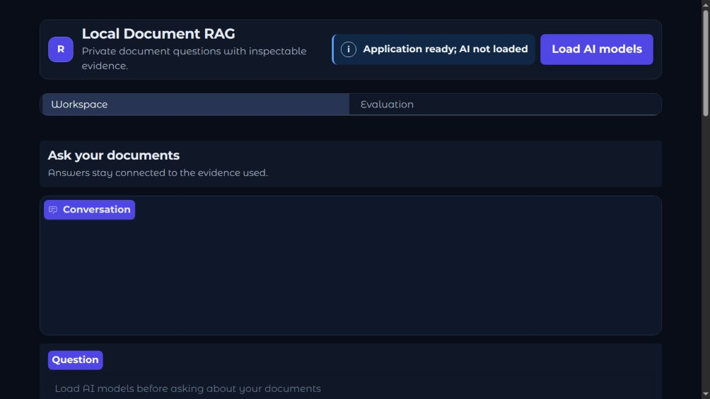
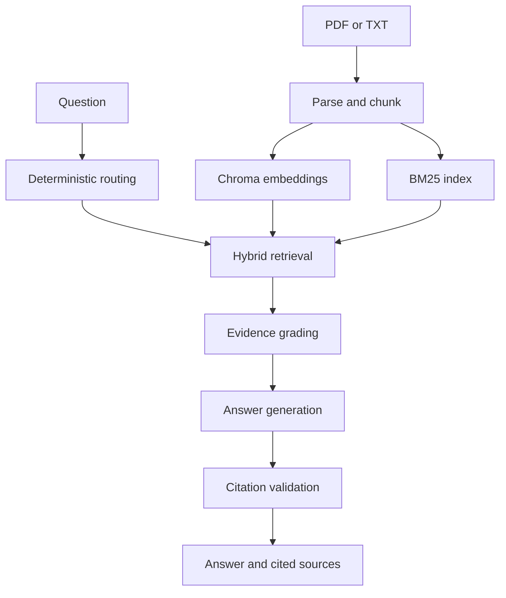

# Local Document RAG

A local-first Retrieval-Augmented Generation application for asking questions about PDF and TXT documents with inspectable evidence. It combines hybrid retrieval, bounded multi-step reasoning, citation validation, and a built-in evaluation workspace while keeping documents and model inference on the user's machine.



## Highlights

- **Local document workflow** — upload, index, inspect, update, and delete PDF or TXT sources from the Gradio interface.
- **Hybrid retrieval** — combines semantic search and BM25 with Reciprocal Rank Fusion, deterministic diversity selection, and stable chunk provenance.
- **Bounded RAG orchestration** — routes simple questions directly, decomposes genuinely multi-hop questions, searches independent subqueries concurrently, and permits at most one targeted retry.
- **Evidence-aware answers** — grades support per subquery, filters irrelevant context, validates citations, and returns a limited answer or abstains when evidence is insufficient.
- **Inspectable results** — exposes cited excerpts, source pages, retrieval scores, public traces, and a downloadable conversation export without revealing private reasoning.
- **Schema v2 evaluation** — compares Dense, BM25, Hybrid, and Agentic systems on MultiHopRAG using retrieval, grounding, answer-quality, and workflow-cost metrics.
- **Graceful local startup** — the interface can open without Ollama; required models are initialized manually when the user is ready.

## How it works



Documents are assigned stable identifiers and stored in a local manifest. At query time, semantic and sparse candidates are fused and selected using score, subquery coverage, document diversity, and redundancy penalties. The application then checks whether every required part of the question is supported before generating and validating the final answer.

## Requirements

- Python 3.12
- [uv](https://docs.astral.sh/uv/)
- [Ollama](https://ollama.com/)
- `qwen3.5:9b`
- `nomic-embed-text`

## Quickstart

```bash
git clone https://github.com/GabrielMBulgarelli/RAG.git
cd RAG

uv python install 3.12
uv sync

ollama pull qwen3.5:9b
ollama pull nomic-embed-text
ollama serve
```

Start the interface:

```bash
uv run python -m modules.run
```

Open [http://127.0.0.1:7860](http://127.0.0.1:7860), add documents in **Workspace**, select **Index files**, and load the AI models when prompted. The UI remains available in limited-readiness mode if Ollama is not running.

## Evaluation

Run the standard schema v2 benchmark on the MultiHopRAG development split:

```bash
uv run python -m modules.evaluation \
  --systems all \
  --split development \
  --dataset multihop
```

The **Evaluation** view automatically loads the latest compatible standard result. Partial system comparisons remain identifiable as custom evaluations and cannot replace the standard benchmark.

## Quality checks

```bash
./scripts/verify.sh
```

The verification gate runs Ruff, Pyright, and the complete offline test suite. Tests do not require Ollama unless explicitly marked for live-model integration.

## Configuration

Settings use the `RAG_` prefix and can be placed in `.env`. Common options include:

```dotenv
RAG_OLLAMA_BASE_URL=http://localhost:11434
RAG_LLM_MODEL=qwen3.5:9b
RAG_EMBEDDING_MODEL=nomic-embed-text
RAG_GRADIO_HOST=127.0.0.1
RAG_GRADIO_PORT=7860
```

Configuration is validated before Ollama or Chroma clients are constructed. Retrieval budgets, chunking, retry limits, paths, and UI settings are also configurable in [`modules/config.py`](modules/config.py).

## Project structure

```text
modules/
├── app.py          # Gradio workspace, callbacks, and presentation adapters
├── citations.py    # Deterministic answer and citation validation
├── evaluation.py   # Schema v2 benchmark runner and metrics
├── rag_graph.py    # Bounded retrieval and answer workflow
├── retrieval.py    # Semantic, BM25, fusion, and final selection
├── vector_db.py    # Ingestion, manifest, and Chroma lifecycle
└── run.py          # Package-safe local entrypoint

scripts/
├── prepare_multihop_eval.py
└── verify.sh

tests/              # Offline unit and integration coverage
```

## What this project demonstrates

- Practical RAG design beyond a basic vector-search demo.
- Deterministic safeguards around probabilistic model behavior.
- Retrieval and answer evaluation with explicit metric applicability.
- Local model integration with graceful failure handling.
- Typed Python, automated quality gates, and an accessible task-oriented UI.

## Acknowledgments

The project began from the [AI Workshop 2025 GenAI Session](https://github.com/Antonio-Tresol/ai_workshop_2025_gen_ai_session) and has since been expanded with document lifecycle management, hybrid retrieval, bounded orchestration, citation validation, evaluation, and a redesigned local interface.
