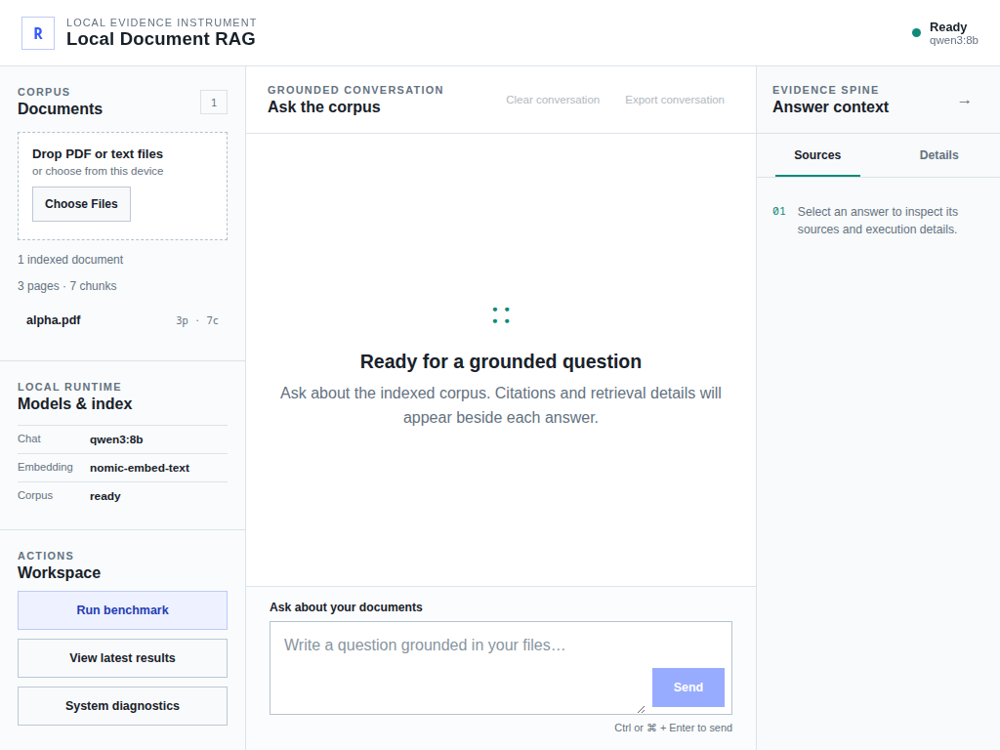
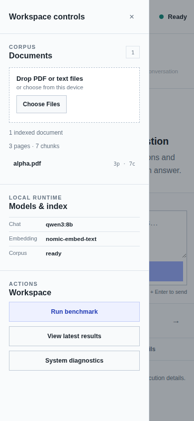
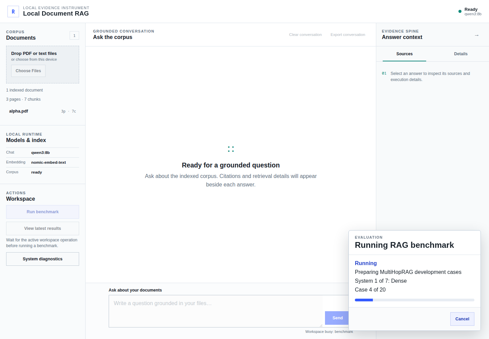
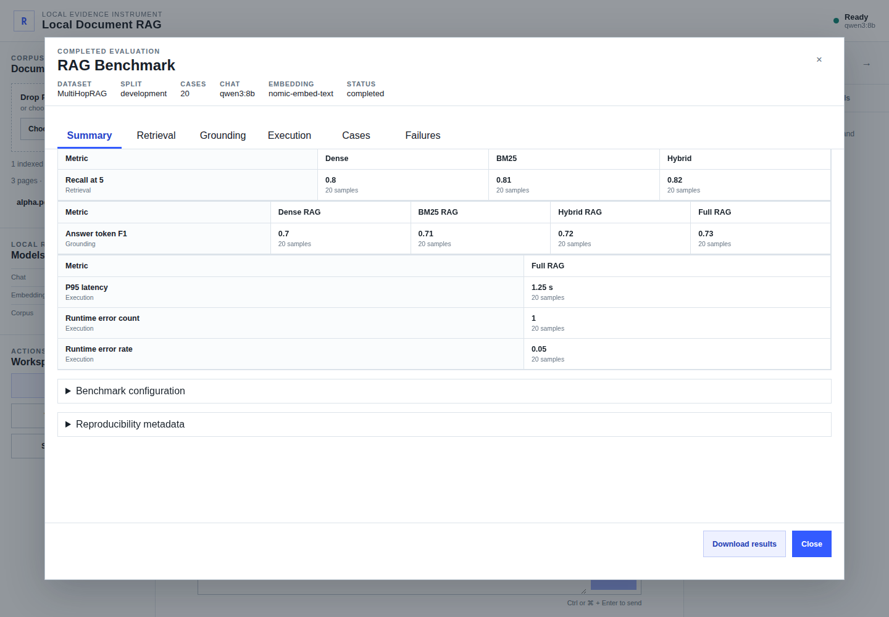
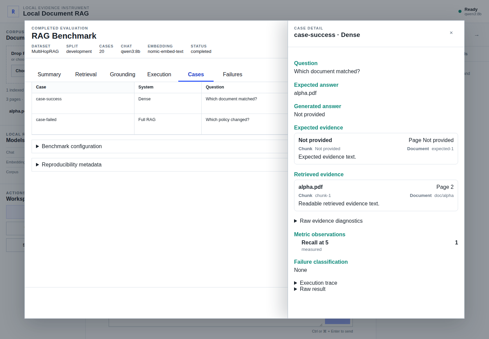
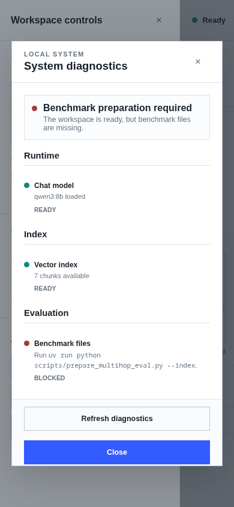

# Visual Verification

These captures show the production React application served by FastAPI at the
desktop, tablet, and mobile viewports used by the Playwright browser suite. The
workspace and benchmark states use deterministic browser fixtures, so they do
not contain private documents and are independent of live Ollama validation.

## Responsive workspace

### Desktop, 1440 × 1000

### Tablet, 1024 × 768

### Mobile sidebar, 390 × 844

## Benchmark inspection

### Progress

### Completed results

### Case evidence

## Diagnostics

